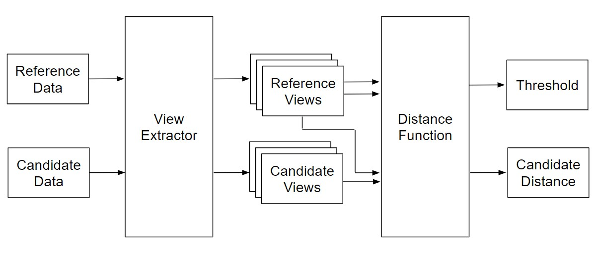
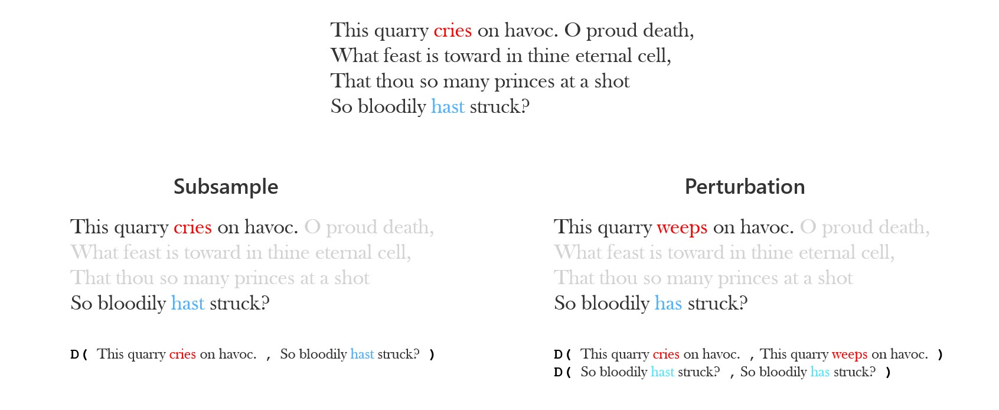
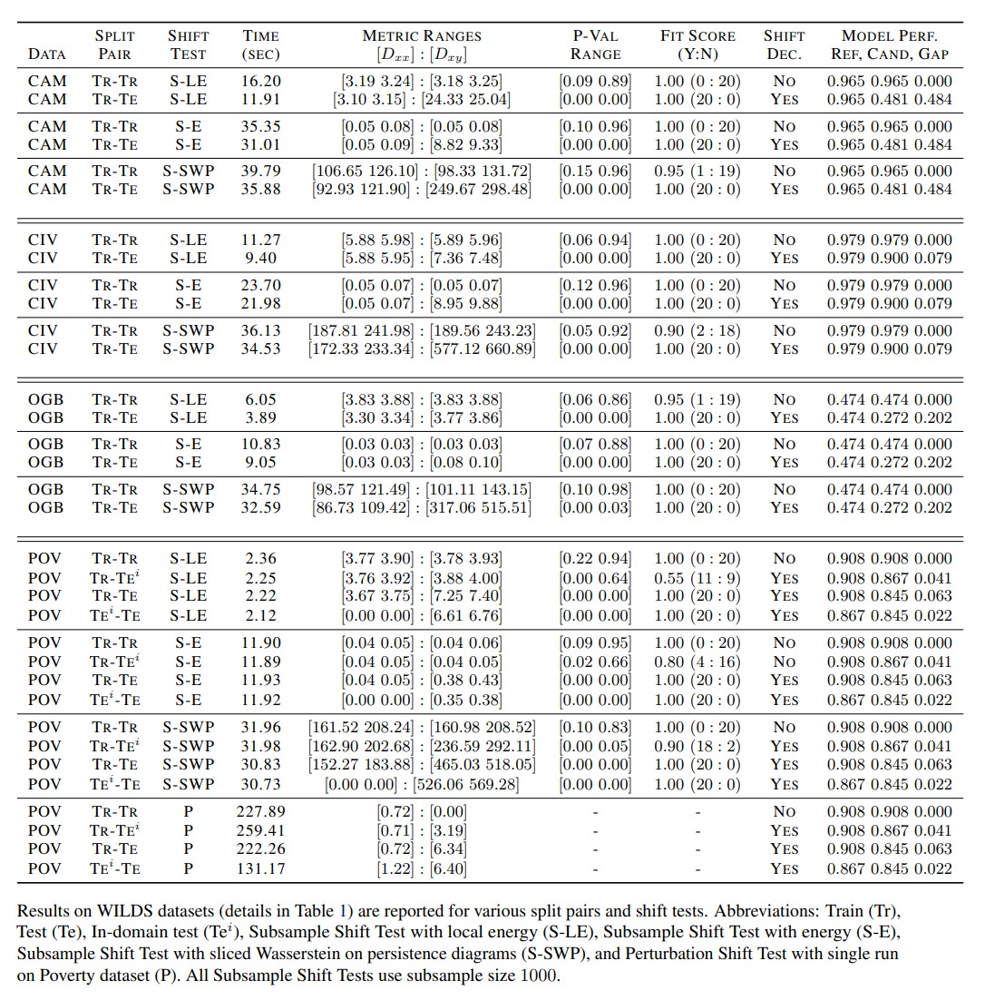

# Discovering Distribution Shift using Latent Representations

## Abstract

Rapid progress in representation learning has led to a proliferation of embedding models, and to associated challenges of model selection and practical application. It is non-trivial to assess a model’s generalizability to new, candidate datasets and failure to generalize may lead to poor performance on downstream tasks. Distribution shifts are one cause of reduced generalizability, and are often difficult to detect in practice. In this paper, we use the embedding space geometry to propose a non-parametric framework for detecting distribution shifts, and specify two tests. The first test detects shifts by establishing a robustness boundary, determined by an intelligible performance criterion, for comparing reference and candidate datasets. The second test detects shifts by featurizing and classifying multiple subsamples of two datasets as in-distribution and out-of-distribution. In evaluation, both tests detect model-impacting distribution shifts, in various shift scenarios, for both synthetic and real-world datasets.

Source: [https://arxiv.org/pdf/2202.02339.pdf](https://arxiv.org/pdf/2202.02339.pdf)

## Distribution Shift Detection Framework


As aid to the description in the paper, consider the following graphic, for intuition about the Subsample Shift Test and the Perturbation Shift Test. In the Subsample Shift Test, we estimate distances between two subsamples of a reference distribution, and use this estimate as a boundary condition of in-distribution versus out-distribution. In the Perturbation Shift Test, we estimate distances between a subsample and a noisy version of that subsample, and use that estimate as a boundary condition. In the example below, the center text is the Reference. The Subsample Shift Test measures distances between a subset of the sentences from the Reference. The Perturbation Shift Test measures distances between single sentences and their modified versions (see words in red and blue).



## Experiment results
Results on real-world, WILDS distribution shift datasets. Modalities include biomedical lymph node tissue images (Camelyon17), online comment text (CivilComments), molecular graphs (OGB-MolPCBA), and satellite images (PovertyMap). High "Fit Score" indicates reliable shift detection.


---

## Setup

### Set up environment:
```
cd distribution-shift-latent-embeddings 
source setup_env.sh
```

### Download embedding datasets:
Embedding datasets can be found in this [public drive](https://drive.google.com/drive/folders/1PsUWh9suYZecvqv1jpcY9rzFzNYDFAHd).
Store in root repo, such that files exist as `distribution-shift-latent-embeddings/embeddings/{mnist,wilds}/*.pkl`.


## Run Experiments and Ablations

```
cd demos
[Adjust settings in `run_experiments.py` to pick dataset for experiment.]
python run_experiments.py
python run_experiments_extract.py -f run_experiments_mnist_small.log
```
```
cd demos
[Run `distribution_shift_local_energy_analysis.ipynb`]
[Run `distribution_shift_mnist_ablation.ipynb`]
```

---

Trademarks This project may contain trademarks or logos for projects, products, or services. Authorized use of Microsoft trademarks or logos is subject to and must follow Microsoft’s Trademark & Brand Guidelines. Use of Microsoft trademarks or logos in modified versions of this project must not cause confusion or imply Microsoft sponsorship. Any use of third-party trademarks or logos are subject to those third-party’s policies.
